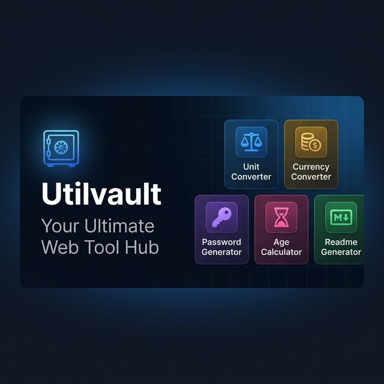

# 🔐 Utilvault — Your Ultimate Web Tool Hub

[](https://rizvee.github.io/Utilvault/)
[](LICENSE)
[](https://rizvee.github.io)

> A beautifully crafted, free all-in-one web utility suite. Fast, private, and requires no sign-up.



---

## 🌐 Live Site

**[rizvee.github.io/Utilvault](https://rizvee.github.io/Utilvault/)**

---

## 🧰 Tools

| Tool | Description | URL |
|------|-------------|-----|
| ⚖️ **Unit Converter** | 60+ units across 8 categories (length, weight, temp, area, volume, time, data, speed) | `/unit-converter/` |
| 💱 **Currency Converter** | Real-time exchange rates for 35+ currencies with BDT default. Auto-refreshes every 60s | `/currency-converter/` |
| 🔑 **Password Generator** | Crypto-secure passwords via `crypto.getRandomValues()`. Fully customizable | `/password-generator/` |
| ⏳ **Age Calculator** | Exact age in years, months, days & hours + live birthday countdown | `/age-calculator/` |
| 📝 **Readme Generator** | Visual GitHub README builder with live Markdown split-pane preview | `/readme-generator/` |
| 🔳 **QR Code Generator** | Custom QR codes with logo overlay, dot styles, color themes — PNG & SVG download | `/qr-generator/` |

---

## ✨ Features

- 🎨 **Modern UI** — Glassmorphism design with dark/light mode
- 📱 **Fully Responsive** — Works on mobile, tablet, and desktop
- ⚡ **Zero Dependencies** — Pure HTML, CSS & Vanilla JS (no frameworks, no bloat)
- 🔒 **Privacy First** — All computations happen locally in the browser, no data is sent to any server
- ♿ **Accessible** — ARIA roles, semantic HTML, keyboard navigable
- 🔍 **SEO Optimized** — Meta tags, Open Graph, Twitter Cards, JSON-LD Schema, sitemap.xml

---

## 📁 Project Structure

```
utilvault/
├── index.html                  # Landing page
├── home.css                    # Landing page styles
├── robots.txt                  # SEO: crawler config
├── sitemap.xml                 # SEO: all page URLs
│
├── assets/
│   ├── css/global.css          # Shared styles (nav, footer, theme tokens)
│   ├── js/nav.js               # Theme toggle + mobile menu + back-to-top
│   └── images/og-image.png     # Open Graph social preview
│
├── unit-converter/
│   ├── index.html
│   ├── style.css
│   └── app.js
│
├── currency-converter/
│   ├── index.html
│   ├── style.css
│   └── app.js                  # Fetches from open.er-api.com, auto-refresh 60s
│
├── password-generator/
│   ├── index.html
│   ├── style.css
│   └── app.js                  # Uses crypto.getRandomValues()
│
├── age-calculator/
│   ├── index.html
│   ├── style.css
│   └── app.js
│
├── readme-generator/
│   ├── index.html
│   ├── style.css
│   └── app.js                  # Uses marked.js for Markdown rendering
│
└── qr-generator/
    ├── index.html
    ├── style.css
    └── app.js                  # Uses qrcode@1.5.3 + Canvas API for logo compositing
```

---

## 🚀 Getting Started

Utilvault is a fully static site — no build step, no server needed.

### Run Locally

```bash
# Clone the repo
git clone https://github.com/rizvee/Utilvault.git

# Open in browser
cd Utilvault
# Just open index.html in any browser
# Or use a local dev server:
npx serve .
```

### Deploy to GitHub Pages

1. Push the repo to GitHub
2. Go to **Settings → Pages**
3. Set source to `main` branch, root folder
4. Your site will be live at `https://<username>.github.io/Utilvault/`

---

## 🛠️ Tech Stack

| Layer | Technology |
|-------|-----------|
| **Structure** | Semantic HTML5 |
| **Styling** | Vanilla CSS (custom properties, glassmorphism, animations) |
| **Logic** | Vanilla JavaScript (ES6+) |
| **QR Codes** | [qrcode@1.5.3](https://github.com/soldair/node-qrcode) + Canvas API |
| **Markdown** | [marked.js](https://marked.js.org/) |
| **Currency API** | [Open Exchange Rates (free)](https://open.er-api.com/) |
| **Icons** | [Font Awesome 6](https://fontawesome.com/) |
| **Fonts** | [Inter — Google Fonts](https://fonts.google.com/specimen/Inter) |

---

## 📊 SEO

- ✅ Unique `<title>` and `<meta description>` per page
- ✅ Canonical URLs pointing to `rizvee.github.io/Utilvault/`
- ✅ Open Graph tags (Facebook, LinkedIn sharing)
- ✅ Twitter Cards (`summary_large_image`)
- ✅ JSON-LD Schema — `WebSite`, `Person`, `WebApplication`, `BreadcrumbList`, `ItemList`
- ✅ `robots.txt` — allows all crawlers
- ✅ `sitemap.xml` — all 6 tool pages with priority & changefreq
- ✅ ARIA roles + semantic HTML for accessibility

---

## 👤 Author

**Hasan Rizvee**

| Platform | Link |
|----------|------|
| 🌐 Portfolio | [rizvee.github.io](https://rizvee.github.io) |
| 🐙 GitHub | [github.com/rizvee](https://github.com/rizvee) |
| 💼 LinkedIn | [linkedin.com/in/hasanrizvee](https://linkedin.com/in/hasanrizvee) |

---

## 📄 License

This project is licensed under the **MIT License** — see the [LICENSE](LICENSE) file for details.

---

<div align="center">
  <p>Crafted with ❤️ by <a href="https://rizvee.github.io">Hasan Rizvee</a></p>
  <p>⭐ Star this repo if you find it useful!</p>
</div>
